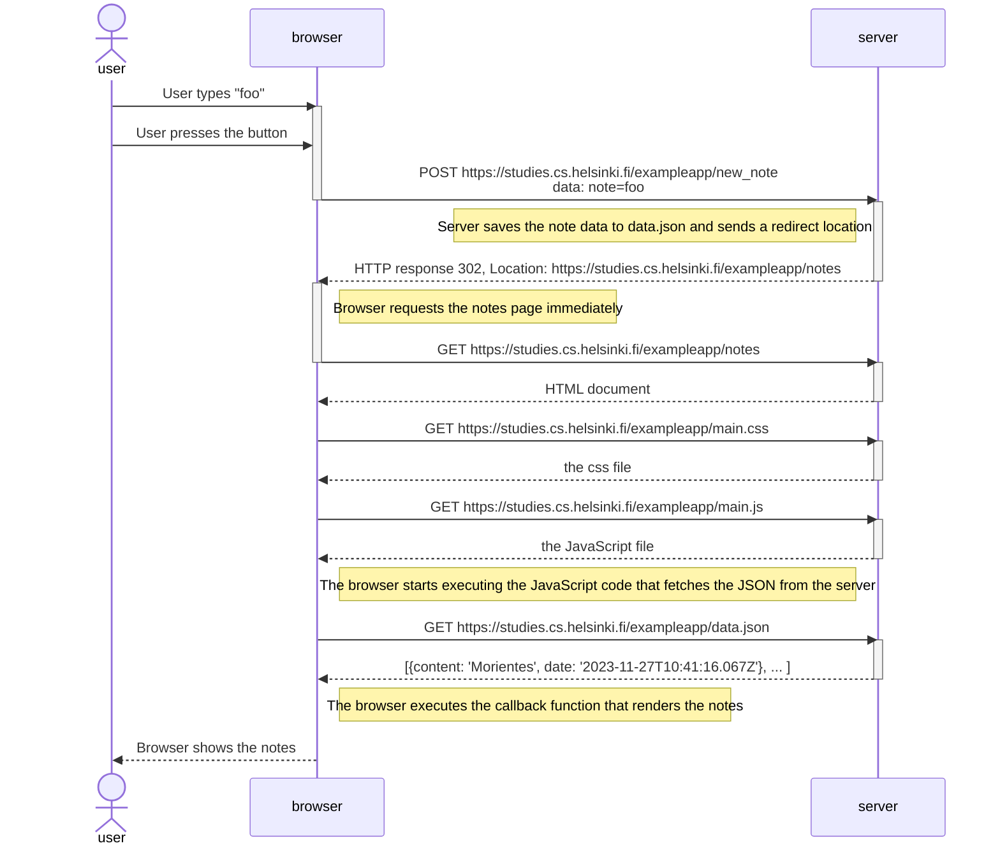

```mermaid
sequenceDiagram
    actor user
    participant browser
    participant server


    user->>browser: User types "foo"
    activate browser
    user->>browser: User presses the button
    browser->>server: POST https://studies.cs.helsinki.fi/exampleapp/new_note <br/> data: note=foo
    deactivate browser
    activate server

    Note left of server: Server saves the note data to data.json and sends a redirect location
    server-->>browser: HTTP response 302, Location: https://studies.cs.helsinki.fi/exampleapp/notes
    deactivate server
    
    activate browser
    Note right of browser: Browser requests the notes page immediately
    browser->>server: GET https://studies.cs.helsinki.fi/exampleapp/notes
    deactivate browser


    activate server
    server-->>browser: HTML document
    deactivate server
    
    browser->>server: GET https://studies.cs.helsinki.fi/exampleapp/main.css
    activate server
    server-->>browser: the css file
    deactivate server
    
    browser->>server: GET https://studies.cs.helsinki.fi/exampleapp/main.js
    activate server
    server-->>browser: the JavaScript file
    deactivate server
    
    Note right of browser: The browser starts executing the JavaScript code that fetches the JSON from the server
    
    browser->>server: GET https://studies.cs.helsinki.fi/exampleapp/data.json
    activate server
    server-->>browser: [{content: 'Morientes', date: '2023-11-27T10:41:16.067Z'}, ... ]
    deactivate server    

    Note right of browser: The browser executes the callback function that renders the notes

    browser-->>user: Browser shows the notes
```